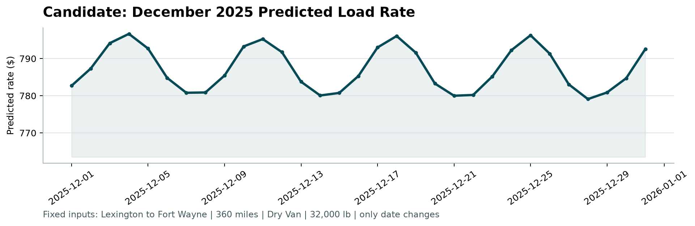

# Freight Rate Prediction

**A leakage-safe machine learning pipeline for forecasting US truckload rates.**

[](https://www.python.org/)
[](https://lightgbm.readthedocs.io/)
[](https://optuna.org/)
[](https://jupyter.org/)

## Overview

This project predicts `posted_rate` for **12,000 freight loads in November and December 2025** using **48,000 labeled loads from January through October 2025**. It also produces a daily December forecast for a fixed Lexington-to-Fort Wayne lane. Because the task is forecasting future prices, the solution uses forward-only temporal validation instead of a random split. The final model is a tuned LightGBM regressor trained on route geometry, shipment details, location, market signals, and calendar seasonality.

## Results

Performance was measured once on an untouched September–October test period after all preprocessing and model settings had been selected using earlier data.

| Model | MAE | RMSE | R² |
|---|---:|---:|---:|
| Median rate-per-mile baseline | $256.95 | $684.24 | 0.7990 |
| **LightGBM** | **$119.89** | **$637.10** | **0.8257** |

The selected model reduced MAE by **53.3%** relative to the median rate-per-mile baseline.



## Methodology

### 1. Data-quality treatment

- Corrects negative shipment weights using their absolute magnitude because they mirror otherwise valid weights and indicate sign-entry errors.
- Leaves missing `weight` and `market_index` values for LightGBM's native missing-value handling.
- Identifies unusual rates using a z-score on log rate per mile: `|z| > 3.5`.
- Removes flagged observations from model-fitting partitions only. Validation and test rows always remain complete.

### 2. Feature engineering

| Feature group | Features |
|---|---|
| Route | Driving distance, haversine distance, route circuity |
| Shipment | Weight, equipment type |
| Geography | Pickup and delivery cities, latitude and longitude |
| Market | Market index, quote signal |
| Calendar | Cyclic day-of-week and day-of-year encodings |

The model predicts `log(posted_rate)` rather than the raw target. This reduces the influence of the target's long right tail and makes model errors more proportional across inexpensive and expensive loads.

### 3. Forward-only validation

| Stage | Training period | Evaluation period | Purpose |
|---|---|---|---|
| Inner fold 1 | January–May | June | Model selection and early stopping |
| Inner fold 2 | January–June | July | Model selection and early stopping |
| Inner fold 3 | January–July | August | Model selection and early stopping |
| Outer test | January–August | September–October | One-time final assessment |

Optuna evaluates 40 LightGBM configurations across the three inner folds. The final tree count is the median best iteration from those folds. September and October are never used for hyperparameter tuning, early stopping, feature selection, or outlier-threshold selection.

### 4. Final training and prediction

After the outer assessment, the frozen pipeline is retrained on all available January–October data and used to generate:

- `validation_predictions.csv` — predictions for all 12,000 November–December loads.
- `data/december_chart_inputs.csv` — 31 daily predictions for the fixed December lane.

Both files pass the supplied structural checks for schema, row count, identifiers, dates, and positive finite predictions.

## Quick start

### Prerequisites

- Python 3.10 or newer
- `pip` and `venv`

### Installation

```bash
git clone https://github.com/AbdullahMakhdoom/Freight_Rate_Prediction.git
cd Freight_Rate_Prediction

python3 -m venv .venv
source .venv/bin/activate
python -m pip install --upgrade pip
python -m pip install -r requirements.txt
```

### Run the analysis

```bash
jupyter lab freight_rate_prediction.ipynb
```

Run the notebook from top to bottom to reproduce the exploration, tuning, assessment, predictions, and December chart.

### Validate the generated outputs

```bash
python score.py \
  --predictions validation_predictions.csv \
  --december-predictions data/december_chart_inputs.csv
```

Expected output:

```text
Validated 12,000 final predictions.
Validated 31 fixed December predictions.
Created chart: scorer_results/candidate_december.png
```

## Repository structure

| Path | Description |
|---|---|
| `freight_rate_prediction.ipynb` | Complete EDA, feature engineering, tuning, evaluation, and prediction workflow |
| `data/train-test.csv` | Labeled January–October development data |
| `data/validation.csv` | Unlabeled November–December prediction data |
| `data/validation-predictions-template.csv` | Required submission schema and load order |
| `data/december-chart-inputs.csv` | Original fixed-lane December inputs |
| `data/december_chart_inputs.csv` | Completed December predictions |
| `validation_predictions.csv` | Final predictions for 12,000 loads |
| `score.py` | Structural output validator and chart generator |
| `freight_rate_prediction_report.pdf` | Concise project report |
| `requirements.txt` | Python dependencies |

## Fixed-lane forecast assumptions

The December chart holds the visible business inputs constant: Lexington to Fort Wayne, 360 miles, Dry Van, and 32,000 lb. Coordinates are recovered from the development data. Since the chart template does not contain `market_index` or `quote_signal`, their daily averages are calculated from the unlabeled December validation rows and joined by date. No future `posted_rate` labels are used.

## Limitations

- Final November-December labels are not included, so the reported metrics come from the untouched September-October backtest.
- Rare rate extremes may depend on operational or contractual information not present in the supplied features.
- The December lane chart uses daily aggregate market signals and should be interpreted as a model-based scenario, not a guaranteed market quote.

## Author

**Abdullah Makhdoom** — [GitHub](https://github.com/AbdullahMakhdoom)
